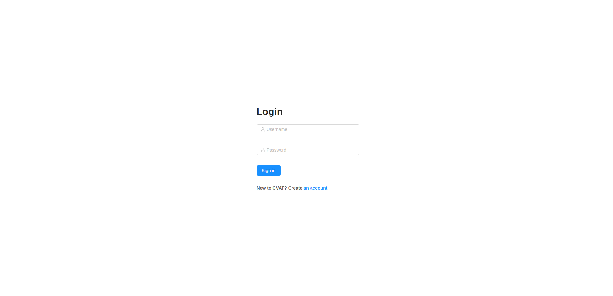
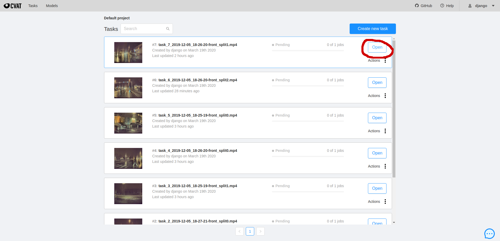
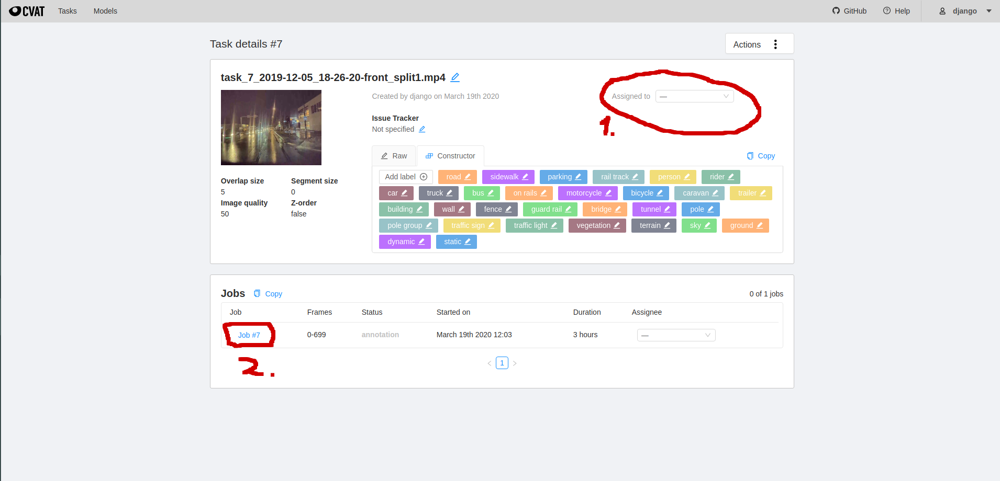
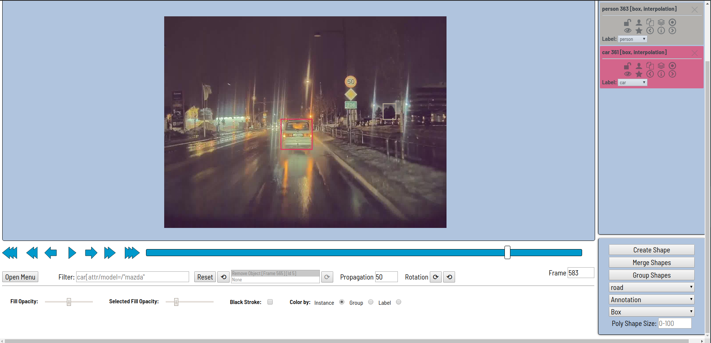
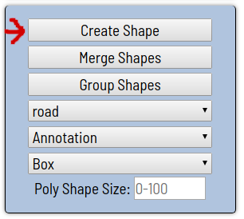
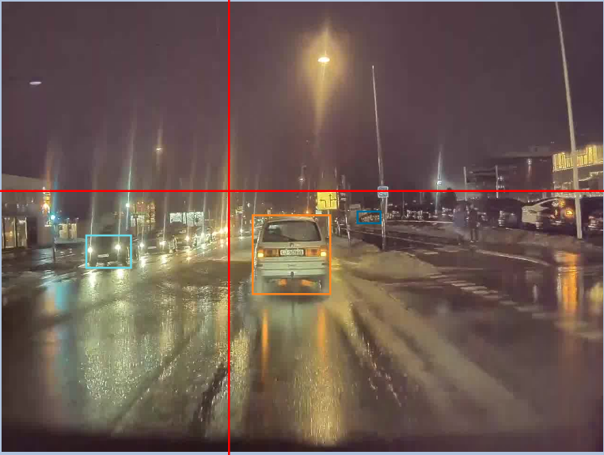
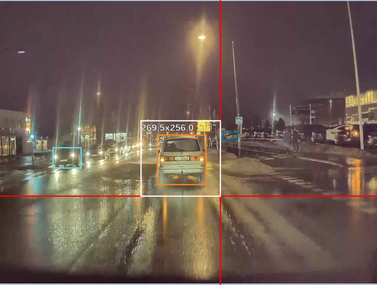
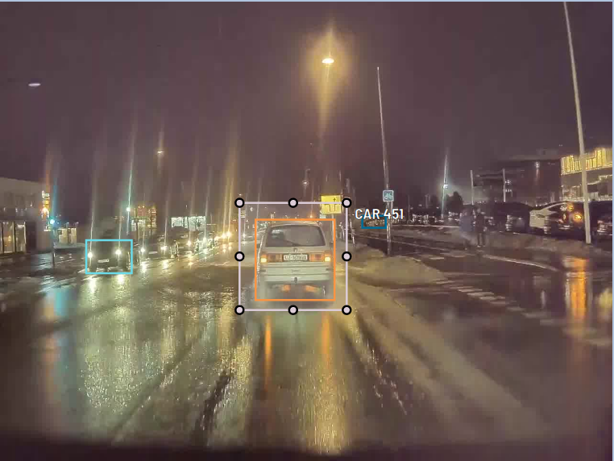
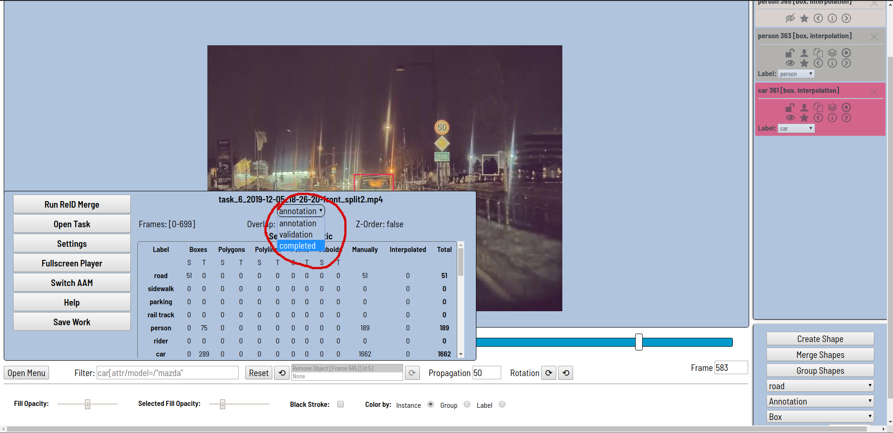

# Walkthrough of TDT4265 Annotation system

Make sure to read through this tutorial before looking at other resources.

## Other resources:
* Labeling tips. From the staff's experience with the tool, here are a couple of tips: [https://piazza.com/class/k53ssppxkwb5yy?cid=185](https://piazza.com/class/k53ssppxkwb5yy?cid=185). 
* Labeling specification. This specifies what should be labeled, how to place bounding boxes, etc.: 
    * We're following Waymo's specification: [https://github.com/waymo-research/waymo-open-dataset/blob/master/docs/labeling_specifications.md#2d-labeling-specifications](https://github.com/waymo-research/waymo-open-dataset/blob/master/docs/labeling_specifications.md#2d-labeling-specifications)
    * **Sign Labeling Specification**:
        - A sign bounding box is created if an object is a sign that is used to regulate traffic flow (the sign subtype is not specified). Examples include: stop signs, yield signs, speed limit signs, warning signs, guide and recreation signs.
        - The following are not labeled: Street name signs, a paper sign / handwritten sign, business board, or any other signs that are not related to traffic.
        - Only label front-facing signs.

* OPENCV CVAT detailed tutorial: [https://github.com/opencv/cvat/blob/develop/cvat/apps/documentation/user_guide.md#interface-of-the-annotation-tool](https://github.com/opencv/cvat/blob/develop/cvat/apps/documentation/user_guide.md#interface-of-the-annotation-tool)

## Login
Open the link to the annotation web server, and log in with your provided username and password.

https://tdt4265-annotering.idi.ntnu.no/

## Open task
Open one of the available tasks visible in the task list by clicking the blue open button.

## Change assignee
From the highlighted drop-down menu, assign the task to your username. This will hide the task from other annotators. Then click the circeled job text to start annotation.

**When you set yourself as the assignee, you're not able to remove yourself. Therefore, you have to finish the annotation task before starting a new one!**

## Used labels
These are the labels that you are supposed to be annotating: 

* person
* sign
* vehicle
* cyclist

These are the same labels as the waymo dataset.

## Annotation

The video file will be browsable on the canvas as shown in the image below. 

Normal playback of the video can be started and paused with the spacebar, and for a frame by frame view, the D and F keys can be used to skip forwards or backwards, frame by frame. The canvas itself can be moved by clicking and dragging, and using the mouse wheel to zoom in and out.

All tasks comes with auto-annotation generated by a Faster R-CNN model trained on COCO, but it is your job to complete the task of annotating all relevant classes in every frame of the video, and correct the existing bounding boxes. The bounding boxes already there can be adjusted by clicking and dragging the box corners, and new bounding boxes can be made by clicking the "create shape" button in the lower right corner.

 

You will now be able to create a new bounding box by clicking on the frame shown on the canvas. 

Move the mouse to cover the shape you wish to annotate. 

Then click to create the box.

Make sure to select the correct class in the dropdown menu below the "create shape button", and try to experiment with the difference between interpolation and annotation drop down options. 

If you create annotation squares, try to experiment with the shortcut ctrl+b, which propogates the current bounding box a set amount of frames forwards in time. This can save time if the object in question does not move much relative to the frame. To delete a bounding box, click the bounding box in question and hit the delete button.

Before you start, it may be easier to run the ReID function, found in the menu in the bottom right, to try to connect similar bounding boxes to the same class instance, as the auto-annotation algorithm has made no effort to do so.

## Task complete
When you complete all frames in the task, mark the task as completed and assign yourself another task from the task list.

Remember to save your work, either from the menu in the bottom left, or hit ctrl+s.
